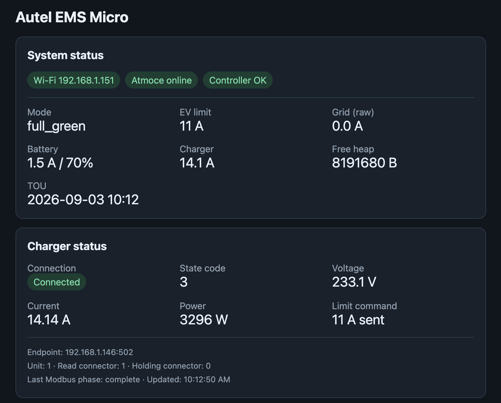

# Autel EMS MicroPython (ESP32-S3-N16R8)

This is a small, independent ESP32-S3 port of the Autel EMS control path. It keeps only:

- Atmoce Web station data as the meter input;
- `full_green` and `max_power` charging modes;
- time-of-use night/weekend maximum-power overrides;
- Autel charger control and status over Modbus TCP;
- a compact local web dashboard for configuration and status.

It intentionally drops Tuya, local Atmoce Modbus, Atmoce Cloud API, green/speed
priority, Playwright, notifications, probes, and the Raspberry Pi buzzer.
The port has no third-party runtime dependencies.

## Requirements

- An ESP32-S3-N16R8 board (16 MiB flash and 8 MiB octal PSRAM).
- Current `ESP32_GENERIC_S3` MicroPython firmware with Octal-SPIRAM support (the
  code also retains compatibility with older `STA_IF`/`AP_IF` network names).
- The charger configured as an EMS Modbus TCP server.
- The Atmoce station ID plus an Atmoce username/password.

## Install on ESP32-S3-N16R8

1. Download the current `ESP32_GENERIC_S3` `.bin` from the **Support for
   Octal-SPIRAM** section at
   <https://micropython.org/download/ESP32_GENERIC_S3/>. Do not use the regular
   ESP32/WROOM image or the non-octal S3 image. Install `esptool` and `mpytool`
   if needed:

   ```sh
   python3 -m pip install --upgrade esptool
   python3 -m pip install --upgrade mpytool
   ```

2. Connect USB. If the serial port does not appear, hold **BOOT**, tap
   **RESET/EN**, then release **BOOT**. On macOS, locate the port with:

   ```sh
   ls /dev/cu.usbmodem* /dev/cu.usbserial* 2>/dev/null
   ```

3. Erase and flash the S3 image at address `0` (not the original ESP32's
   `0x1000`). Replace the port and firmware filename:

   ```sh
   python3 -m esptool --port /dev/cu.usbmodemXXXX erase-flash
   python3 -m esptool --port /dev/cu.usbmodemXXXX --baud 460800 write-flash 0x0 ESP32_GENERIC_S3-SPIRAM_OCT-20260824-v1.29.0.bin
   ```

   If high-speed flashing fails, omit `--baud 460800`. Tap RESET after the
   write. The runtime USB port may have a different name from the bootloader
   port, so list ports again.

4. Verify that MicroPython detected the S3 and PSRAM:

   ```sh
   mpytool -p /dev/cu.usbmodemXXXX exec "import os,gc; print(os.uname()); gc.collect(); print('heap_free',gc.mem_free())"
   ```

   `os.uname().machine` should identify an ESP32-S3. Free heap should be far
   larger than on ESP32-WROOM; if it is only around 100–300 KiB, recheck that
   the `SPIRAM_OCT` firmware was used.

5. From the repository root, upload the application and configured settings:

   ```sh
   mpytool -p /dev/cu.usbmodemXXXX -f -Z cp \
     micropython/boot.py micropython/config_store.py \
     micropython/tou_schedule.py micropython/policy.py \
     micropython/modbus_tcp.py micropython/atmoce_web.py \
     micropython/web_server.py micropython/main.py \
     micropython/config.json : -- reset -- monitor
   ```

   Omit `micropython/config.json` if using the setup access point.

## Configuration

`config.json` is ignored by Git because it contains Wi-Fi and Atmoce secrets.
Start from `config.example.json`, or upload the existing local `config.json`.
The web form can change all of these settings after installation.

| JSON key | Meaning |
|---|---|
| `wifi_ssid`, `wifi_password` | 2.4 GHz upstream Wi-Fi credentials |
| `setup_ap_password` | Password for the fallback setup AP; minimum 8 characters |
| `charger_host`, `charger_port`, `charger_unit_id` | Autel Modbus TCP endpoint |
| `read_connector_id` | Connector index used for input/status reads; current setup uses `1` |
| `holding_connector_id` | Connector index used for holding-register writes; current setup uses `0` |
| `policy_mode` | `full_green` or `max_power` |
| `charger_min_amps`, `charger_max_amps` | Charging-current limits |
| `feedback_step_amps`, `full_green_hold_seconds` | Full-green feedback tuning |
| `update_interval_s` | Control-loop period |
| `atmoce_station_id` | Atmoce Web station ID |
| `atmoce_username`, `atmoce_password` | Direct API login credentials |
| `atmoce_password_encoded` | `false` for plain password; `true` for pre-encoded API/Base64 value |
| `atmoce_token`, `atmoce_session` | Optional existing authentication values |
| `grid_voltage_v` | Voltage used to convert Atmoce power to current |
| `tou_enabled` | Enable the TOU maximum-power override |
| `tou_utc_offset_minutes` | Fixed local UTC offset; Bangkok is `420` |
| `tou_night_start`, `tou_night_end` | Overnight maximum-power window |
| `tou_weekend_saturday`, `tou_weekend_sunday` | All-day weekend overrides |

With no working Wi-Fi configuration, the device starts an access point named
`AutelEMS-XXXXXX` with the default password `configure-me`. Connect to it and open
`http://192.168.4.1/`. Saving changed Wi-Fi credentials reboots the board. Change the
setup AP password in the same form before normal use.

On normal Wi-Fi, read the assigned IP from the serial console and open it in a browser.
The dashboard exposes `/api/status`, redacted `/api/config`, `POST /api/config`, and
`/health`. Its charger card shows Modbus connectivity and phase, raw charger state,
voltage, current, power, commanded limit, endpoint, unit ID, and the independent read
and holding connector IDs.

### Dashboard



## Control behavior

- `full_green` uses `(gridPower + storagePower) / grid_voltage_v`, preserves the
  battery-aware feedback step and 0–1 A import dead band, and holds the configured
  minimum-current floor for the configured period before allowing 0 A. Both offline
  limits are 0 A.
- The dashboard's **Grid (raw)** metric shows `gridPower / grid_voltage_v`. This is
  intentionally different from the adjusted grid value used internally by Full Green.
- If Atmoce data is missing, or authentication cannot be refreshed, full-green mode
  immediately commands 0 A. This fail-closed behavior is deliberate for unattended
  embedded operation.
- `max_power` commands the configured maximum for online and offline limits and skips
  Atmoce HTTPS requests entirely.
- When TOU is enabled, its night window and selected weekend days override the base
  mode with maximum power. The default reproduces the original Bangkok schedule:
  UTC offset `+420` minutes, 22:00-09:00, all day Saturday and Sunday. The ESP32 syncs
  UTC with NTP at startup and every six hours. If its clock is invalid, TOU remains
  inactive and the dashboard reports the clock problem.
- The controller writes current mode and the Autel limit block at
  `20000 + holding_connector_id × 1000`, then reads the 23-word input status block at
  `10000 + read_connector_id × 1000`. Read and holding connector IDs are deliberately
  independent; the current configuration reads connector `1` and writes connector `0`.

The control cycle uses blocking TLS and Modbus sockets inside one `asyncio` loop to keep
RAM use low. Consequently, the dashboard can pause briefly while a network request is
in progress. Atmoce HTTPS uses SNI but the default MicroPython TLS configuration may not
validate server certificates on every firmware build; use a trusted LAN and current
firmware, and treat the bearer token as a secret. Serial failures include the network
phase, endpoint, Wi-Fi state, free heap, and exception to distinguish DNS, TCP, TLS,
HTTP, and Modbus failures.

## Troubleshooting

- If the Modbus connection is disconnected, the charger may need to be restarted
  before it will accept a new connection.

## Host-side tests

The pure policy, configuration, Atmoce parsing, and Modbus framing tests run without
hardware:

```sh
PYTHONPYCACHEPREFIX=/tmp/autelems-pycache python3 -m unittest discover -s micropython/tests -v
```

Hardware acceptance still requires verifying one full-green ramp, one meter-failure
fail-safe, max mode, charger reconnect, configuration persistence, and ESP32 reboot.

## License

This project is licensed under the [MIT License](LICENSE).
